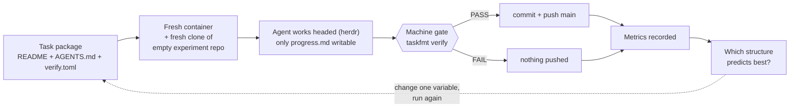

# task-format

## The question

> Hand one bounded task to a fresh coding agent in a fresh container. Change only **how the task package is written**. Which structure makes the agent's output most predictable?

Same task. Same machine gate. Fresh container, fresh clone, fresh agent. Only the way the task is written changes. That is the whole project — everything else exists to make the answer trustworthy.

The artifact under study is the **task package** the agent receives: task content in `README.md`, the agent protocol in `AGENTS.md`, and declarative gate config in `verify.toml`.

## Why it matters

Agents (Claude Code first, Codex second) are told what to do in markdown, and the same task can be written many ways — a vague one-liner, a strict checklist, a spec with acceptance criteria. Task-writing advice today is folklore: "be specific", "add acceptance criteria". We could find no controlled comparison of structured vs prose task specs, so this project builds one.

Predictability = harness-computed metrics (pass rate, false-DONE rate, scope violations, diff stability across repeats) — never the agent's own claim, never a human eyeball.

## How a run works

Rules that keep runs comparable:

1. One task = one fresh container = one fresh clone of a disposable experiment repo. Never reuse state.
2. The agent sees the task read-only; only `progress.md` is writable, and it is never committed.
3. A machine gate decides PASS/FAIL. A failed task never pushes.
4. All orchestration is one Rust binary, `taskfmt` — no shell scripts in the execution path.
5. Agents run headed (live terminal via herdr) so any session can be inspected.

## What's inside

| Path | What it is |
|---|---|
| `docs/research/RESEARCH-FINDINGS.md` | Source of truth: method, metrics, decisions D1–D39 |
| `reference/task-template/` | The pure task-package template (schema `task/v4`) |
| `harness/` | `taskfmt` — all execution tooling, one Rust binary |
| `experiments/` | Task packages TASK-001..007, fixtures, run outputs (data only) |
| `experiment.toml` | Versioned experiment manifest: images, runtime, agent profiles |

## Status

The control format (`task/v4`) is built; the comparison matrix (checklist depth, rule count, protocol placement, executable checklists, …) is the planned comparison phase, run as one-variable-at-a-time ablations against the control. Today the sequence TASK-001..007 exercises the harness end to end, building a complete terminal PostgreSQL client (`pgtui`, Rust) from an empty repo, one gated task at a time — shakeout runs, not measured comparisons yet.

## License

Apache License 2.0 — see [LICENSE](LICENSE).
